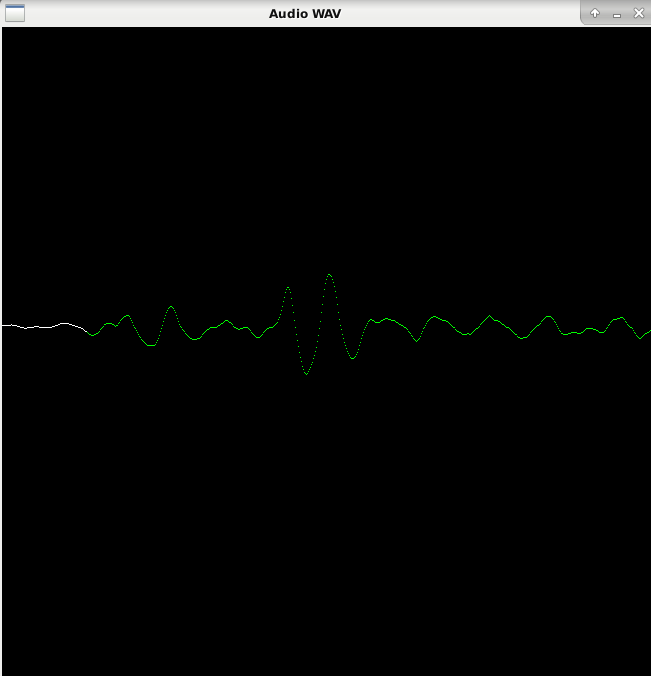

# wave-viewer

Programme qui permet de visualiser les ondes d'un fichier audio wav. 
Il permet également de séparer les mots d'une phrase saccadée.

## Manuel utilisateur 

### Compilation 

Pour compiler, il faut avoir préalablement installer SDL, puis faire :

```sh
make
```

Pour exécuter le programme avec le fichier **/env/alphabet_a_h.wav**, 
il faut faire : 

```sh
./build/src/arnold env/alphabet_a_h.wav 
```
Ainsi, on pourra visualiser les ondes :



Puis obtenir un fichier audio non saccadé **build/result.wav**
